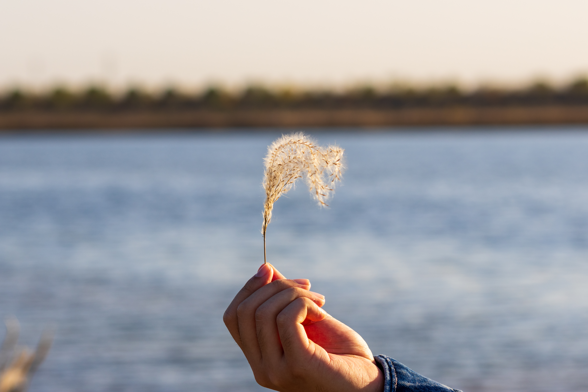

# Photo Watermark Helper

从照片 EXIF 提取拍摄时间和地点，批量生成带有半复古水印的照片。

## 安装

```bash
uv sync
```

## 样张

| 原图 | 水印后 |
|:---:|:---:|
|  |  |
|  |  |
|  |  |

## CLI 使用

直接运行会进入引导模式：

```bash
uv run watermarker
```

处理单张或多张照片：

```bash
uv run watermarker add photo.jpg another.jpg -o output/
```

批量处理目录：

```bash
uv run watermarker batch photos/ -o output/ --recursive
```

生成预览：

```bash
uv run watermarker preview photo.jpg --style retro --open
```

查看可提取的 EXIF 信息：

```bash
uv run watermarker inspect photo.jpg
```

常用选项：

```bash
--style retro|minimal|glass|film|stamp
--position auto|top-left|top-right|bottom-left|bottom-right
--fields time,location,camera,lens
--on-exists skip|rename|overwrite
--no-geocode
--dry-run
```

## 照片冲印

引导模式会询问是否开启冲印模式，可选 `3.5x5`、`4x6`、`5x7`、`6x8`、`8x10` 英寸。

```bash
uv run watermarker add photo.jpg \
  --print-size 4x6 \
  --dpi 300 \
  --fit crop \
  --safe-margin-mm 5 \
  --style retro
```

`crop` 会裁切铺满相纸，`contain` 会保留完整画面并补白边。`retro` 默认使用电子管数字与点阵中文字体；可在 `.env` 中配置字体路径。
